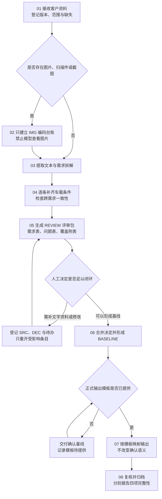

# 车载智能座舱需求分析团队 SOP

文件编号：SOP-CRA-001
配套工具包版本：0.4.0
生效方式：团队试用；项目责任人采用本流程时记录本次使用版本。
适用岗位：系统需求工程师及参与需求确认、资料登记和交付的团队成员。

## 1. 目的与产物

将客户文本输入整理为车载系统需求，经人工确认形成基线，再按项目模板交付。要求文本原始信息可追溯、每条适度分析、必要决策由人确认。

标准产物为：输入清单、图片编码台账（适用时）、评审包、人工决定记录、确认基线、模板输出与追溯映射。

规范性执行规则以 [SKILL](SKILL.md)、[车载分析规则](references/automotive-analysis.md)、[图片禁用与编码策略](references/image-handling.md)和[评审基线规则](references/review-and-baseline.md)为准。

## 2. 图片处理红线

在本工作流中，模型不得打开、预览、识别、OCR、描述、分类或推断图片，不得调用图片工具、视觉模型、截图接口或外部识别服务。

图片只建立 `IMG-xxx` 编码台账。“编码”指追溯编号，不是 Base64 或二进制处理。正文需要图片语义时，由项目人员另行提供纯文字 SRC 或明确 DEC；模型不通过查看图片验证这些文字。

## 3. 角色与准备

| 角色 | 责任 |
|---|---|
| 系统需求工程师（执行人） | 建立文本范围与台账、运行 Skill、组织问题、合并决定和维护版本 |
| 资料登记人（可由执行人兼任） | 根据文件清单、文档结构或输入方信息登记 DOC／IMG 编码与位置 |
| 确认责任人 | 确认内容、策略、范围和冲突；用独立文字提供图片相关行为决定 |
| 交付负责人（可由执行人兼任） | 检查基线与输出一致性，归档交付 |
| Skill 维护人 | 维护通用规则和包版本，组织模型更换后的试用 |

开始时明确本次确认责任人；角色不是额外审批层级，可以由同一人承担多项职责。

## 4. 操作总览

| 步骤 | 执行人 | 输入 | 输出 | 完成标准 |
|---|---|---|---|---|
| 01 接收与定范围 | 系统需求工程师 | 客户资料、项目规范 | 输入清单 | 版本、文本可读范围及缺失已登记 |
| 02 图片编码登记 | 资料登记人 | 文件清单、结构信息、正文引用 | IMG 台账 | 已知图片有编号和影响；模型未查看图片 |
| 03 文本提取与拆解 | 工程师＋模型 | 可访问文本 | 需求初稿、来源映射 | 已读文本全部有去向，未读范围保留 |
| 04 车载分析与一致性检查 | 工程师＋模型 | 初稿、项目依据 | 分析结果和 Q 清单 | 必要缺口明确，无无据默认值 |
| 05 人工评审 | 确认责任人 | REVIEW 评审包 | DEC 决定记录 | 决定绑定版本、对象和范围 |
| 06 合并与基线 | 工程师＋模型 | 评审与决定 | 完整确认正文、BASELINE | 入基线条目不依赖未知图片语义 |
| 07 模板输出 | 工程师＋模型 | 基线、实际模板 | 输出稿、字段映射 | 有效基线全覆盖，缺字段不编造 |
| 08 复核与归档 | 交付负责人 | 输出与追溯资料 | 交付记录、归档版本 | 四项完整性分别说明，范围真实 |

## 5. 分步执行

### 01 接收资料与明确范围

1. 保存原始资料及版本，不覆盖客户原件。
2. 填写 [项目输入表](assets/project-intake.md)，登记 DOC、文本范围、附件引用、车型配置及已有项目约束。
3. 明确本 Skill 只读取文本；图片、扫描件和截图固定禁用。
4. 正式模板未提供时注明；照常开始需求评审，不自行选择或伪造项目模板。

完成条件：本轮资料和文本可读范围明确。输入范围未知时，不承诺原始资料全量覆盖。

### 02 图片编码登记

1. 根据输入方清单、正文引用或无需读取像素的文档结构信息识别待登记对象。
2. 使用 [图片编码登记表](assets/image-register.md) 分配 IMG 编号，记录 DOC／版本、页码或锚点、对象标识和关联需求。
3. 未知类型、数量、位置或版本关系写未知；不得为补齐字段打开图片。
4. 正文仅写“见图”或关键行为依赖图片时，创建资料缺失类 Q，关联受影响 REQ。
5. 人工另行提供的纯文字说明记录为 SRC，项目行为决定记录为 DEC；保留提供者和适用范围。

完成条件：已知图片对象有编码和影响状态，并明确声明模型未查看、识别或 OCR 图片。图片语义受阻的条目保持待补资料或待人工决定。

### 03 完整提取与需求拆解

1. 为可读文本片段分配 SRC，保留可定位原文及关键要素。
2. 按独立可验证的行为形成 REQ，关联条件、约束、例外与文本来源。
3. 背景、术语、重复、矛盾及疑似超范围文本保留去向，不静默删除。
4. 分批资料维护全局编号与进度，最后跨批核对。

完成条件：已读文本均有处理去向；无法识别或尚未读取的文本另列。IMG 编号不作为已读取内容。

### 04 车载适用性与一致性分析

1. 按 [车载分析规则](references/automotive-analysis.md) 逐条筛查车辆状态、电源、控制边界、反馈、驾驶场景、多入口、异常和配置。
2. 对每项补充回答：不明确是否导致不同的行为、责任边界或验收结论？
3. 必要缺口进入 Q，记录影响、建议与依据；可选增强单列；充分需求记录无需补充。
4. 写轻量验证关注点，并检查公共规则、输入输出和条目间冲突。

完成条件：原文、整理、补充可分辨；无编造阈值、策略和安全等级；每条有简短分析结论。

### 05 提交人工评审

1. 生成带 REVIEW 版本的 [评审包](assets/review-pack.md)，标明文本范围、图片编码范围与资料版本。
2. 先展示需求评审表和问题表，来源及 IMG 台账作为附表。
3. 确认责任人按版本、REQ／Q／IMG 编号给出原意、策略、修改或范围决定。
4. 保存原始回复及 DEC；决定者和时间无法取得时如实注明。

完成条件：收到的决定对象明确。模型不能代替人确认，也不能通过图片调用补齐决定。

### 06 合并决定与形成基线

1. 将明确采纳的文字决定合并为完整需求正文，并展示差异。
2. 已有确认明确覆盖合并后含义的，沿用确认；产生新语义时只确认受影响部分。
3. 检查必要问题、矛盾、公共规则、图片语义依赖及跨需求依赖。
4. 只将符合资格的条目纳入 [确认基线](assets/baseline-and-template-mapping.md)。

完成条件：每条入基线需求有完整正文、文本来源／DEC 和明确范围，无未定必要条件或未知图片语义依赖。

### 07 按正式模板输出

1. 取得实际模板及版本，区分固定内容、字段和示例。
2. 建立 REQ／RULE 到章节／字段的映射。
3. 只填确认基线。缺字段依据或无承载位置时列具体缺口及方案。
4. 没有来源字段时将映射附表独立保存，不擅自改变强制模板结构。

完成条件：基线确认范围全部有承载位置，输出语义与基线一致。

### 08 复核、交付与归档

逐项核对：

- 文本读取完整性：正文、表格文本、备注和附件文本范围是否明确且已处理。
- 图片编码完整性：已知图片是否有 IMG 编号、位置、版本和影响；固定声明模型未查看图片。
- 信息去向完整性：每个文本要素是否映射或有明确处置。
- 本版本落实完整性：确认纳入范围是否全部输出，数字、单位、否定、条件与例外是否保持。
- 反向依据：每条正式要求都有文本来源或人工 DEC；IMG 不能单独作为依据。
- 版本一致性：输入、IMG 台账、REVIEW、DEC、BASELINE、模板和输出可相互追溯。

归档原件、输入清单、图片编码台账、评审包、决定、基线、正式模板、输出和映射。本 Skill 不自动发送资料给客户或其他人员。

## 6. 常见情况的处理

| 情况 | 处理 | 可以继续的部分 |
|---|---|---|
| 输入含图片或截图 | 只登记 IMG，不打开、不 OCR、不描述 | 无图片语义依赖的文本需求 |
| 图片数量或位置未知 | 图片编码范围记未知，列影响 | 已知文本范围 |
| 正文只写“见图” | 登记 IMG 和资料缺失类 Q | 无关需求 |
| 人工提供纯文字说明 | 记录 SRC；行为决定记录 DEC | 依据充分且确认覆盖的条目 |
| 只确认原意 | 保存决定，必要补充继续待决 | 完善条目，不自动形成正式基线 |
| 拒绝某补充建议 | 必要缺口需替代决定；可选项可结束 | 已充分的原需求 |
| 缺最终模板 | 交付评审或确认基线 | 提取、分析、确认 |
| 图片文件更新 | 更新 IMG 版本和依赖，不做视觉比较 | 未受影响且确认仍有效的条目 |
| 换模型或会话 | 交接文本范围、IMG 台账、REQ／RULE／Q／DEC 和有效基线 | 已具备文本证据的工作 |

## 7. 维护与试用

Skill 维护人更新源文件和 VERSION，再运行打包脚本生成合并版及 ZIP。不得分别维护两个不一致的模型指令版本。

首次启用、换模型或实质修改规则时，执行 [试用场景](examples/smoke-cases.md)，重点观察模型是否在收到图片时保持零图片调用。记录工具包与模型版本、实际输入输出、发现问题和处理结果。

项目采用本 SOP 不代表完成法规或安全认证。具体车载约束由项目依据和有权确认人员确定。
