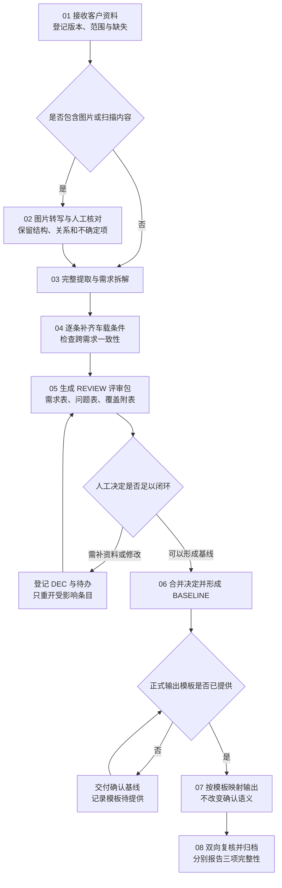

# 车载智能座舱需求分析团队 SOP

文件编号：SOP-CRA-001
配套工具包版本：0.3.0
生效方式：团队试用；项目责任人采用本流程时记录本次使用版本。
适用岗位：系统需求工程师及参与需求确认、资料处理和交付的团队成员。

## 1. 目的与产物

将客户输入整理为车载系统需求，经人工确认形成基线，再按项目模板交付。要求原始信息可追溯、每条适度分析、必要决策由人确认。

标准产物为：输入清单、图片转写记录（适用时）、评审包、人工决定记录、确认基线、模板输出与追溯映射。

规范性执行规则以 [SKILL](SKILL.md)、[车载分析规则](references/automotive-analysis.md)、[图片策略](references/image-handling.md)和[评审基线规则](references/review-and-baseline.md)为准。本 SOP 说明人员如何协作执行。

## 2. 角色与准备

| 角色 | 责任 |
|---|---|
| 系统需求工程师（执行人） | 建立范围与台账、运行 Skill、组织问题、合并决定和维护版本 |
| 资料处理人（可由执行人兼任） | 检查原始范围、转写图片并记录核对情况 |
| 确认责任人 | 按团队授权确认内容、策略、范围和冲突；需要时协调相关专业 |
| 交付负责人（可由执行人兼任） | 检查基线与输出的一致性，归档交付 |
| Skill 维护人 | 维护通用规则和包版本，组织模型更换后的试用 |

开始时明确本次确认责任人；其他背景缺失只在影响当前需求时补充。角色不是额外审批层级，可以由同一人承担多项职责。

## 3. 操作总览

| 步骤 | 执行人 | 输入 | 输出 | 完成标准 |
|---|---|---|---|---|
| 01 接收与定范围 | 系统需求工程师 | 客户资料、项目规范 | 输入清单 | 版本、实际可读范围及缺失已登记 |
| 02 图片转写 | 资料处理人 | 原图、扫描页、图表 | 图片清单与转写记录 | 每张图有状态，未知信息明确 |
| 03 提取与拆解 | 工程师＋模型 | 原文、已收到转写 | 需求初稿、来源映射 | 全部已读信息有去向，未读范围保留 |
| 04 车载分析与一致性检查 | 工程师＋模型 | 初稿、项目依据 | 分析结果和 Q 清单 | 必要缺口明确，无无据默认值 |
| 05 人工评审 | 确认责任人 | REVIEW 评审包 | DEC 决定记录 | 决定绑定版本、对象和范围 |
| 06 合并与基线 | 工程师＋模型 | 评审与决定 | 完整确认正文、BASELINE | 入基线条目满足资格条件 |
| 07 模板输出 | 工程师＋模型 | 基线、实际模板 | 输出稿、字段映射 | 有效基线全覆盖，缺字段不编造 |
| 08 复核与归档 | 交付负责人 | 输出与追溯资料 | 交付记录、归档版本 | 三项完整性分别说明，范围真实 |

## 4. 分步执行

### 01 接收资料与明确范围

1. 保存原始资料及版本，不覆盖客户原件。
2. 填写 [项目输入表](assets/project-intake.md)，登记 DOC、附件、车型配置及已有项目约束。
3. 确认模型实际能否读取文件、处理图片、访问规范；将不可访问资料列缺口。
4. 正式模板未提供时注明；照常开始需求评审，不自行选择或伪造项目模板。

完成条件：清楚知道本轮要处理什么、已提供什么、还缺什么。输入范围未知时，不承诺原文全量覆盖。

### 02 图片转写与核对

1. 能访问原图的一方建立 IMG 清单，标明扫描页、局部裁剪、重复图及版本关系。
2. 使用 [图片转写交接表](assets/image-transcription.md) 记录原始文字、结构关系、不确定项及解释。
3. 核对流程箭头、分支条件、表格对应、界面状态、车辆条件、数字、单位和备注。
4. 将核对后的纯文本交接给分析模型；保留未核对范围及受影响对象。

完成条件：每个图片项都有明确处理状态。没有识图能力时保留缺口并继续独立内容；未处理图片不能视为已读。视觉内容直接影响的条目暂不进入基线，除非有独立明确决定消除该依赖。

### 03 完整提取与需求拆解

1. 为原文片段分配 SRC；保留可定位原文及关键要素。
2. 按独立可验证的行为形成 REQ，关联条件、约束、例外与来源。
3. 背景、术语、重复、矛盾及疑似超范围内容保留去向，不静默删除。
4. 分批资料维护全局编号与进度，最后跨批核对。

完成条件：已读范围内的原始信息均已登记处理去向；无法识别或尚未读取内容另列，不能混入完成数量。

### 04 车载适用性与一致性分析

1. 按 [车载分析规则](references/automotive-analysis.md) 逐条筛查车辆状态、电源、控制边界、反馈、驾驶场景、多入口、异常和配置。
2. 对每项补充回答：不明确是否导致不同的行为、责任边界或验收结论？
3. 必要缺口进入 Q，记录影响、建议与依据；可选增强单列；充分需求记录无需补充。
4. 为需求写轻量验证关注点，并检查公共规则、输入输出和条目间冲突。

完成条件：原文、整理、补充可分辨；无编造阈值、策略和安全等级；每条有简短分析结论。相同公共问题集中处理，不逐条重复提问。

### 05 提交人工评审

1. 生成带 REVIEW 版本的 [评审包](assets/review-pack.md)，标明范围与资料版本。
2. 先展示需求评审表和问题表，来源及细节作为附表供核对。
3. 确认责任人按版本、REQ／Q 编号给出原意、策略、修改或范围决定。
4. 保存原始回复及 DEC；决定者和时间无法取得时如实注明。

完成条件：收到的决定对象明确。不要求本轮一次解决所有问题；未确认内容保持原状态。模型不能代替人做确认。

### 06 合并决定与形成基线

1. 将已明确采纳的决定合并为完整需求正文，并展示差异。
2. 已有确认明确覆盖合并后含义的，沿用确认；产生新语义时仅请确认受影响部分。
3. 检查必要问题、矛盾、公共规则、图片及跨需求依赖。
4. 只将符合资格的条目纳入 [确认基线](assets/baseline-and-template-mapping.md)，其余保留评审状态。

完成条件：每条入基线需求有完整正文、来源／DEC 和明确范围，无未定必要条件。

特别规则：“确认原意”不等于“可入基线”；拒绝必要问题的某个建议不等于问题解决。部分基线须说明范围，并确保已纳入条目不依赖暂缓项的未定行为。

### 07 按正式模板输出

1. 取得实际模板及版本，区分固定内容、字段和示例。
2. 建立 REQ／RULE 到章节／字段的映射；需要的背景和范围说明另标类型。
3. 只填确认基线。缺字段依据或无承载位置时列具体缺口及方案。
4. 没有来源字段时将映射附表独立保存，不擅自改变强制模板结构。

完成条件：基线中的确认范围全部有承载位置，输出语义与基线一致。模板尚未提供时交付基线，阶段注明“模板输出待完成”。有缺口的输出明确标为草稿或限定范围的阶段稿。

### 08 复核、交付与归档

逐项核对：

- 读取完整性：原始页、图、表、备注、附件范围是否明确且已完成读取／核对。
- 信息去向完整性：每个来源要素是否映射或有明确处置；不是只核对编号数量。
- 本版本落实完整性：确认纳入范围是否全部输出，数字、单位、否定、条件与例外是否保持。
- 反向依据：每条正式要求都有来源或人工补充决定；可选未采纳内容没有混入。
- 版本一致性：输入、图片、REVIEW、DEC、BASELINE、模板和输出可相互追溯。

完成条件：给出真实范围及未闭环项；未知范围不报 100%。如团队授权交付限定范围，保留范围决定，不能将其表述为原始全量完成。

归档：原件、输入清单、图片记录、评审包、决定、基线、正式模板、输出和映射。通过团队既有渠道交付，本 Skill 不自动发送给客户或其他人员。

## 5. 常见情况的处理

| 情况 | 处理 | 可以继续的部分 |
|---|---|---|
| 缺图片、OCR 只有文字 | 登记 IMG 缺口和所需关系，等待转写核对 | 与缺口无依赖的需求 |
| 原文与图或多份规范冲突 | 保留双方依据并登记 Q | 无冲突部分 |
| 只确认原意 | 保存决定，必要补充继续待决 | 完善条目，不自动形成正式基线 |
| “按某规范”但规范未提供 | 请求对应条款，Q 保持需补资料 | 不依赖该规范的内容 |
| 拒绝某补充建议 | 必要缺口需替代决定；可选项可结束 | 已充分的原需求 |
| 缺最终模板 | 交付评审／确认基线 | 提取、分析、确认 |
| 资料或图片更新 | 比较前后版本，检查影响链 | 未受影响且确认仍有效的条目 |
| 换模型／换会话 | 交接版本台账、原文、REQ／RULE／Q／DEC 和有效基线 | 已具备证据的工作 |

## 6. 维护与试用

Skill 维护人更新源文件和 VERSION，再运行打包脚本生成合并版及 ZIP。不得分别维护两个不一致的模型指令版本。

首次启用、换模型或实质修改规则时，执行 [试用场景](examples/smoke-cases.md)。记录工具包与模型版本、实际输入输出、发现问题和处理结果。真实客户资料仅在团队允许的环境中使用。

项目采用本 SOP 不代表完成法规或安全认证。具体车载约束由项目依据和有权确认人员确定。
